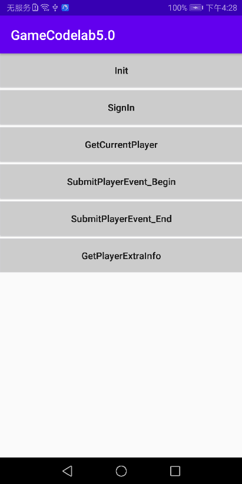

# Game Service Kit

## Table of Contents

 * [Introduction](#Introduction)
 * [Getting Started](#Getting Started)
 * [Supported Environments](#Supported Environments)
 * [Result](#Result)
 * [License](#License)

## Introduction
   GameServiceKit Android sample code encapsulates APIs of the HUAWEI GameSevice Kit. It provides many sample programs for your reference or usage.
The following describes API of Huawei game service in the MainActivity.java .

## Getting Started

   1. Check whether the Android studio development environment is ready. Open the sample code project directory with file "build.gradle" in Android Studio. Run TestApp on your divice or simulator which have installed latest Huawei Mobile Service(HMS).
   2. Register a [HUAWEI account](https://developer.huawei.com/consumer/en/).
   3. Create an app and configure the app information in AppGallery Connect.
   See details: [HUAWEI Game Service Development Preparation](https://developer.huawei.com/consumer/en/doc/development/HMSCore-Guides/config-agc-0000001050166285)
   4. To build this demo, please first import the demo in the Android Studio (3.x+).
   5. Configure the sample code:
   (1) Download the file "agconnect-services.json" of the app on AGC, and add the file to the app root directory(\app) of the demo.
   (2) Change the value of applicationid in the app-level build.gradle file of the sample project to the package name of your app.
   6. Run the sample on your Android device or emulator.

## Supported Environments
   Android SDK Version >= 23 and JDK version >= 1.8 is recommended.

## Result
   

##  License
   GameSeviceKit sample is licensed under the: [Apache License, version 2.0](http://www.apache.org/licenses/LICENSE-2.0).